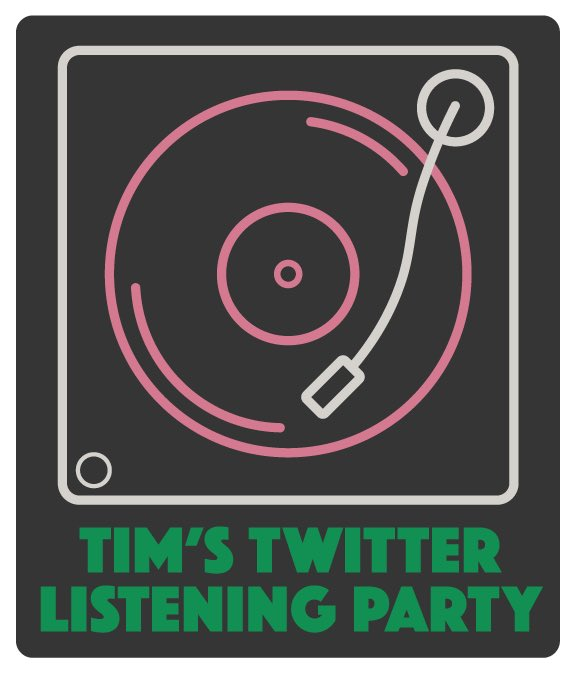

## timstwitterlisteningparty

Simple [website] page to hold the dates/times and bands and albums for [#timstiwtterlisteningparty].

[website]: http://www.timstwitterlisteningparty.com
[#timstiwtterlisteningparty]: https://twitter.com/hashtag/timstwitterlisteningparty?src=hash

## Static HTML

The static html code to serve a simple blog type template with tables of data - one for each week of listening party's.

Layout examples using [Pure CSS][pure] compiled from the [pure-site][] project.

[pure]: http://purecss.io/
[pure-site]: https://github.com/pure-css/pure-site

Chucked in some bootstrap as well for the cards - and a [new design is probably on its way using all bootstrap](http://test.timstwitterlisteningparty.com)
as the [pure] library not really updated anymore

## Data

The time slot website data is driven by a simple csv file - which can be found [here](data/time-slot-data.csv) and is in the form:

|Date            |Bane                     |Album                      |Confirmation Tweet                                             |Replay                                                          |Tweeters                                                                       |Tweet Archive                                                    |Spotify Link                                         |Spotify Album Image                                             |
|----------------|-------------------------|---------------------------|--------------------------------------------------------------|----------------------------------------------------------------|-------------------------------------------------------------------------------|-----------------------------------------------------------------|-----------------------------------------------------|----------------------------------------------------------------|
|2020-05-07T21:00|Mansun                   |Six                        |https://twitter.com/Tim_Burgess/status/1250136623888596993    |https://timstwitterlisteningparty.com/pages/replay/feed_119.html|@mansunband:@PaulDraper:@Tim_Burgess                                           |https://twitter.com/LlSTENlNG_PARTY/timelines/1258643424368037888|https://open.spotify.com/album/4r7lhWQUuTZFmKd32CTF49|https://i.scdn.co/image/ab67616d00001e0225191e98837083ff597e0b93|
|2020-05-07T22:00|Low                      |I Could Live In Hope       |https://twitter.com/lowtheband/status/1245037423689687041     |https://timstwitterlisteningparty.com/pages/replay/feed_120.html|@lowtheband:@Tim_Burgess                                                       |https://twitter.com/LlSTENlNG_PARTY/timelines/1258643419729145856|https://open.spotify.com/album/61dByu8oBt4qdym9Rkz39w|https://i.scdn.co/image/ab67616d00001e028b7a5660aeb00a285ca66ffe|
|2020-05-08T19:55|British Sea Power        |Valhalla Dancehall         |https://twitter.com/BSPOfficial/status/1256329609743699968    |https://timstwitterlisteningparty.com/pages/replay/feed_121.html|@BSPOfficial:@Tim_Burgess                                                      |https://twitter.com/LlSTENlNG_PARTY/timelines/1259106253202231296|https://open.spotify.com/album/30v7ves6lmxqFRRonwRWTr|https://i.scdn.co/image/ab67616d00001e0232f5a397fc21bb88ddfdd9c8|
|2020-05-08T21:00|Idles                    |Brutalism                  |https://twitter.com/Tim_Burgess/status/1250710520128253953    |https://timstwitterlisteningparty.com/pages/replay/feed_122.html|@idlesband:@Tim_Burgess                                                        |https://twitter.com/LlSTENlNG_PARTY/timelines/1259106259434901506|https://open.spotify.com/album/3VrfVLndSkH81aE4CqivdI|https://i.scdn.co/image/ab67616d00001e02290bb9e9b283adb76c6438fb|
|2020-05-08T22:00|DMA's                    |Hills End                  |https://twitter.com/dmasmusic/status/1244214009064075264      |https://timstwitterlisteningparty.com/pages/replay/feed_123.html|@dmasmusic:@Tim_Burgess                                                        |https://twitter.com/LlSTENlNG_PARTY/timelines/1259106264266805248|https://open.spotify.com/album/7wzjcXj61rw9FNcazuc683|https://i.scdn.co/image/ab67616d00001e026fef5e4bea5b2ad414a150f1|
|2020-05-09T19:00|The Stranglers           |The Raven                  |https://twitter.com/Tim_Burgess/status/1258386368956436480    |                                                                |                                                                               |                                                                 |https://open.spotify.com/album/6fN9sINhwev0HjGw7mdAKu|https://i.scdn.co/image/ab67616d00001e020472f26c28f13fcd2277f5c7|
|2020-05-09T20:30|Frankie Goes to Hollywood|Welcome To The Pleasuredome|https://twitter.com/TheHollyJohnson/status/1250507417881845765|https://timstwitterlisteningparty.com/pages/replay/feed_124.html|@TheHollyJohnson:@Tim_Burgess                                                  |https://twitter.com/LlSTENlNG_PARTY/timelines/1259425452923461632|https://open.spotify.com/album/0FU4Eo42Oyg1We3eRrOf4m|https://i.scdn.co/image/ab67616d00001e02275774501f737e10d92adaca|
|2020-05-09T22:00|The Libertines           |The Libertines             |https://twitter.com/Tim_Burgess/status/1258091264664383491    |https://timstwitterlisteningparty.com/pages/replay/feed_125.html|@libertines:@carlbaratmusic:@gdogg27:@JohnCoryHassall:@petedoherty:@Tim_Burgess|https://twitter.com/LlSTENlNG_PARTY/timelines/1259425458715795456|https://open.spotify.com/album/4Fpg7zSk9EdANLYiPXd7ri|https://i.scdn.co/image/ab67616d00001e021af9a1d5d54e49897c0746b2|
|2020-05-10T18:00|Frightened Rabbit        |The Midnight Organ Fight   |https://twitter.com/Tim_Burgess/status/1253276244482969602    |                                                                |                                                                               |                                                                 |https://open.spotify.com/album/69voh97i16t9SrQeHWIqrY|https://i.scdn.co/image/ab67616d00001e02e2e1b5e61d34df2e3b15a176|
|2020-05-10T19:00|White Lies               |To Lose My Life            |https://twitter.com/Tim_Burgess/status/1256940513699168257    |https://timstwitterlisteningparty.com/pages/replay/feed_126.html|@whiteliesmusic:@Tim_Burgess                                                   |https://twitter.com/LlSTENlNG_PARTY/timelines/1259732455151591424|https://open.spotify.com/album/1ySdrRPZa9ZRvlcUoGv8UE|https://i.scdn.co/image/ab67616d00001e0232fc28e3e988cd9911429b88|
|2020-05-10T20:00|The Lovely Eggs          |This Is Eggland            |https://twitter.com/Tim_Burgess/status/1255203415724081152    |https://timstwitterlisteningparty.com/pages/replay/feed_127.html|@TheLovelyEggs:@Tim_Burgess                                                    |https://twitter.com/LlSTENlNG_PARTY/timelines/1259732459048091648|https://open.spotify.com/album/33QBBIlW2XWY5ZI8Jy1as5|https://i.scdn.co/image/ab67616d00001e0277471a21c45366fbdc8cb93f|
|2020-05-10T21:00|Idles                    |Joy as an Act of Resistance|https://twitter.com/Tim_Burgess/status/1250710520128253953    |https://timstwitterlisteningparty.com/pages/replay/feed_128.html|@idlesband:@Tim_Burgess                                                        |https://twitter.com/LlSTENlNG_PARTY/timelines/1259732463170940928|https://open.spotify.com/album/7BbRSUBwTB37ut0Ht3yAqt|https://i.scdn.co/image/ab67616d00001e0222f5be50ae2fbf54de60b995|
|2020-05-10T22:00|Ride                     |Weather Diaries            |https://twitter.com/Tim_Burgess/status/1254724571225350144    |https://timstwitterlisteningparty.com/pages/replay/feed_129.html|@rideox4:@Andybebop:@doctorloz:@Tim_Burgess                                    |https://twitter.com/LlSTENlNG_PARTY/timelines/1259732467948367872|https://open.spotify.com/album/1Gl0WP7ql5E1XfmDultlVC|https://i.scdn.co/image/ab67616d00001e0249e510c9d98dc17e61b3cd88|

The record shop website data controlled another simple csv file - which can be found [here](data/record-store-data.csv) and is in the form:

|NAME            |ADDRESS                                                         |WEBSITE                                              |TWITTER                             |
|----------------|----------------------------------------------------------------|-----------------------------------------------------|------------------------------------|
|Creekside Vinyl |3 Market Street,Faversham, Kent ME13 7AH                        |https://creeksidevinyl.co.uk/                        |https://twitter.com/Creeksidevinyl  |
|Cliffs Margate  |172 Northdown Road Margate, England, CT9 2QN United Kingdom     |http://www.cliffsmargate.com                         |https://twitter.com/cliffsmargate   |
|Ben Oneill      |64 O'Connell Street, Dungarvan, Co. Waterford, Ireland, X35 HF54|http://www.benoneilldungarvan.com/                   | https://twitter.com/BenONeillRecord|
|Freebird Records|15a Wicklow Street Dublin                                       | https://freebirdrecords.com/                        |https://twitter.com/FreebirdRecords |
|Bella Union     |Online BN1 1AJ Brighton                                         |https://bellaunion.ochre.store/bella-union-vinyl-shop|https://twitter.com/VinylBella      |
|Spiller Records |27 The Morgan Arcade, CARDIFF CF10 1AF                          | http://spillersrecords.com/                         |https://twitter.com/spillersrecords |

This is also used to drive the [google map](https://drive.google.com/open?id=1XhFWnejDpNMuz2qG6iIOt5WIAdcEXFjX&usp=sharing)

The bookshop data is driven by two files - the [reviews](data/book-review-data.csv)

|Author                           |Title                                                                        |Description                                                                                                                                                                                                                                                                                                                                                                                                       |Reviewer Twitter                    |Initials|Website                                                                                       |
|---------------------------------|-----------------------------------------------------------------------------|------------------------------------------------------------------------------------------------------------------------------------------------------------------------------------------------------------------------------------------------------------------------------------------------------------------------------------------------------------------------------------------------------------------|------------------------------------|--------|----------------------------------------------------------------------------------------------|
|Bob Stanley                      |Yeah Yeah Yeah: The Story of Modern Pop                                      |As well as being in one of my favourite bands, St. Etienne, Bob Stanley has been a top music journalist for years. In this book he recounts the history of pop music from 1952 onwards; the detail is encyclopaedic, and the stories are eye-opening.                                                                                                                                                             |https://twitter.com/Tim_Burgess     |(TB)    |  https://blackwells.co.uk/bookshop/product/Yeah-Yeah-Yeah-by-Bob-Stanley-author/9780571322404|
|Dave Haslam                      |Searching for Love: Courtney Love in Liverpool, 1982                         |This short book – perfect for these discombobulating times – debunks the myths around the five months Love spent in Liverpool in 1982, apparently hanging out with Julian Cope and the Bunnymen. Love is a great story teller, but is she also an unreliable narrator?                                                                                                                                            |https://twitter.com/amy_raphael     |(AR)    | https://www.confingopublishing.uk/product-page/easter-offer-3-for-20-22-50-outside-uk        |
|Pete Paphides                    |Broken Greek                                                                 |Pete’s memories of growing up in Birmingham in an immigrant, Greek household, and finding friendship with music is so engaging. He’s barely into his teens by the end of the book. We need more.                                                                                                                                                                                                                  | https://twitter.com/Tim_Burgess    |(TB)    | https://www.foxlanebooks.co.uk/                                                              |
|Tim Burgess                      |One, Two, Another                                                            |After Tim’s revealing and so readable autobiography ‘Telling Stories’ he took us round the world in his ‘Tim Book Two’ about his passion for records, and record shops from Istanbul to San Francisco. ‘One, Two Another’ is the Tim Burgess lyrics collection, interspersed with his stories and memories from writing songs over the last thirty years; a great way to tell a story of a life immersed in music.|https://twitter.com/Mr_Dave_Haslam  | (DH)   |  http://www.claphambooks.com/                                                                |
|Amy Raphael                      |A Seat at the Table                                                          |Interviews with Women on the Frontline of Music’ Amy’s previous work has included interviews with Patti Smith and Courtney Love etc. In this book she talks to some amazing contemporary artists, inc Kate Tempest, Nadine Shah, Christine & the Queens. Important insights on every page.                                                                                                                        | https://twitter.com/Mr_Dave_Haslam | (DH)   | https://www.foxlanebooks.co.uk/                                                              |
|Carrie Brownstein                |Hunger Makes Me a Modern Girl: Carrie Brownstein                             |The guitarist of Sleater-Kinney writes about growing up in the Pacific Northwest in a dysfunctional family and then finding herself in ‘America’s best rock band’ (Greil Marcus) in the mid-90s. She is an excellent writer, but it’s the disarming honesty that pulls you in.                                                                                                                                    |https://twitter.com/amy_raphael     | (AR)   | https://www.forumbooksshop.com/                                                              |
|David Barnett and Martin Simmonds|Punk's Not Dead                                                              |A graphic novel that concerns the increasingly wild (and supernatural) adventures of a kid who finds himself best friends with Sid Vicious's ghost. But all is not what it seems. Set in the here and now, this captures punk's spirit. There are 2 volumes, and both are great.                                                                                                                                  |https://twitter.com/Beathhigh       | (IR)   | https://www.linghams.co.uk/                                                                  |
|David Cavanagh                   |My Magpie Eyes Are Hungry For The Prize                                      |Ostensibly about the rise and fall of Creation Records, but this being a book by the great David Cavanagh, it's about so much more than that. It's essential reading for anyone who wants to know how indie mutated from its anti-mainstream, anti-rockist, DIY outsider roots to the very opposite of all those things. A scintillating read.                                                                    |https://twitter.com/petepaphides    | (PP)   | http://www.claphambooks.com/                                                                 |
|David Hepworth                   |1971 – Never A Dull Moment                                                   |Beneath his imperturbably circumspect shell, Hepworth is as breathlessly enthusiastic a writer as his longtime sidekick Mark Ellen, and this book in which he argues that 1971 was the greatest ever year for music is the perfect vehicle for that enthusiasm. The chapter about Rod Stewart's rise to superstardom is worth the asking price alone.                                                             |https://twitter.com/petepaphides    | (PP)   | https://www.foxlanebooks.co.uk/                                                              |
|Kirstin Innes                    |Scabby Queen The rise and fall of a one-hit wonder                           |This novel focuses more on the main character's life after music, charting her political activism and various friendships. There are betrayals along the way, but it's a humane and searching story.                                                                                                                                                                                                              |https://twitter.com/Beathhigh       | (IR)   | https://blackwells.co.uk/bookshop/product/Scabby-Queen-by-Kirstin-Innes-author/9780008342296 |
|Lizzie Goodman                   |Meet Me in the Bathroom: Rebirth and Rock and Roll in New York City 2001-2011|This leave-no-stone-unturned oral history is pieced together with the voices of bands like the Strokes, Kings of Leon and Interpol, thus presenting multi-narrative memories of the same period. It’s often gossipy rather than reverent, but better for it.                                                                                                                                                      |https://twitter.com/amy_raphael     |(AR)    | http://www.city-books.co.uk/                                                                 |

and a the [ list of shops](data/book-shops-data.csv)

|Name              |Address            |Website                                 |type|
|------------------|-------------------|----------------------------------------|----|
|Blackwells        |various locations  | https://blackwells.co.uk/bookshop/home |    |
|Book-ish          |Crickhowell NP8 1BD| http://www.book-ish.co.uk/             |    |
|Clapham Books     |London, SW4 0JA    | http://www.claphambooks.com/           |    |
|Cover to Cover    |Swansea, SA3 4BQ   |  http://cover-to-cover.co.uk/          |    |
|David’s Bookshop  |Letchworth, SG6 3DE| https://www.davids-bookshops.co.uk/    |    |
|Ebb & Flo Bookshop|Chorley, PR7 2EJ   | http://ebbandflobookshop.co.uk/        |    |
|Edinburgh Bookshop|Edinburgh EH10 4DH | https://www.edinburghbookshop.com/     |    |
|Forum             |Corbridge, NE45 5AW|  https://www.forumbooksshop.com/       |    |
|Fox Lane Books    |pop-up locations   | https://www.foxlanebooks.co.uk/        |    |

## Replay

The [replay code](https://github.com/ajbrindle/listeningpartyreplay) is provided by [@andrewb1970](https://twitter.com/andrewb1970)

## Tools

TODO - explain the spring boot shell tool in the tools folder.  Basically takes the [csv data](data/time-slot-data.csv)
and generates the [upcoming-time-slots.html](snippets/upcoming-time-slots.html), [date-tbd-time-slots.html](snippets/date-tbd-time-slots.html) [all-time-slots.html](snippets/all-time-slots.html)
and the [completed-time-slots.html](snippets/completed-time-slots.html) from it as well as the [record store](snippets/record-stores.html)

A Lambda also exists that can be added to aws and triggered when the S3 bucket PUT's the time-slot-data.csv into it and writes
the files above back to the bucket (including the record stores which are derived from the record-store-data.csv)

## Tasks

- [x] Drive tabular data from file
- [ ] Document shell tool, write tests and link to [codefactor](https://www.codefactor.io)
- [x] Break up generation of html into upcoming, date tbc and archived
- [x] Add new archive page
- [x] Investigate twitter api for listening period date range for archive page
- [ ] Add shell command to preview index.html
- [x] Add TBC Page
- [x] Sort archive page latest to oldest
- [x] Add lambda to auto create html snippets from csv in github
- [x] Update lambda to invalidate the Cloud Front cache after writing the html to the s3 buckets
- [x] Redesign tables to use cardgroups
- [x] Move data csv files to a separate folder
- [x] Show tweeters involved in listening party on index
- [ ] rejig menu/button options
- [X] add each replay tweets to a twitter collection
- [x] rejig the all.html and use cards/implement a better search
- [x] rejig the wall.html to work on all viewports
- [ ] rejig the record stores into cards
- [ ] banner needs improving
