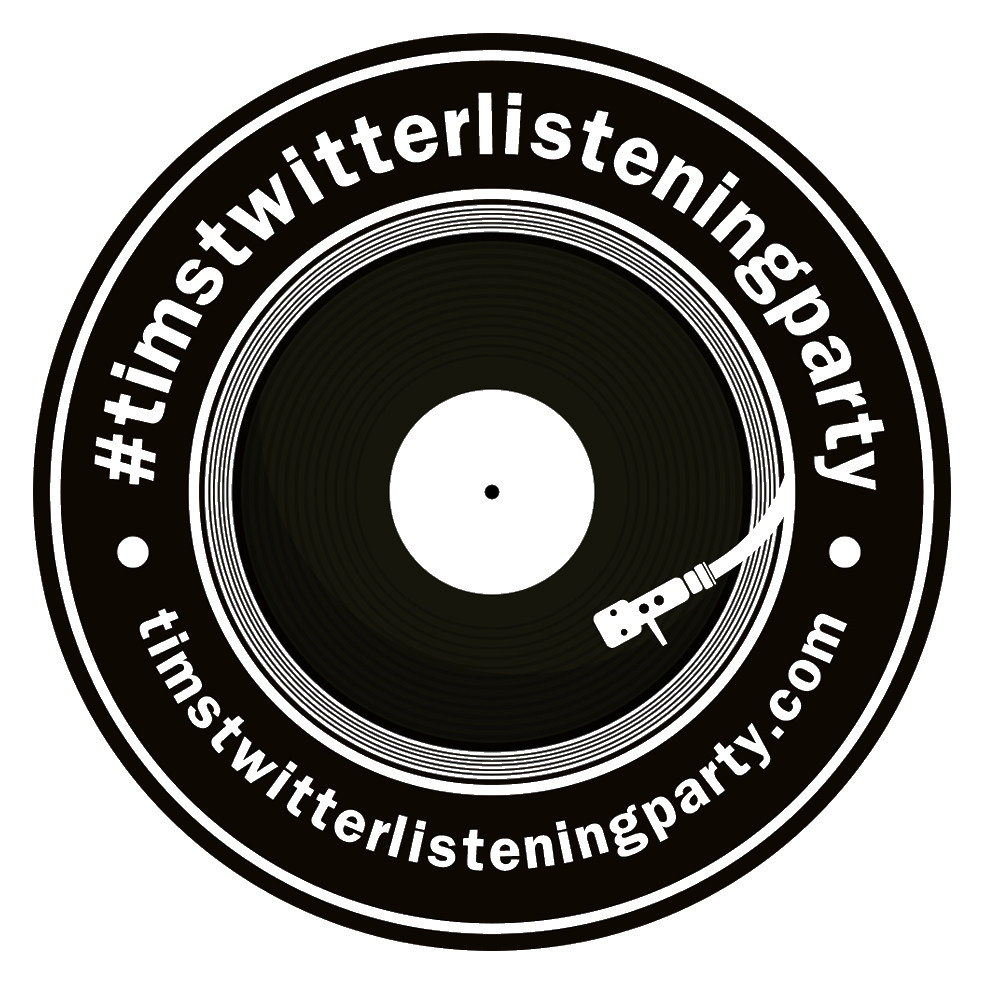

###### [Image By Dave Atkinson](https://twitter.com/chipiedavea)

## timstwitterlisteningparty

Simple [website] page to hold the dates/times and bands and albums for [#timstiwtterlisteningparty].

[website]: http://www.timstwitterlisteningparty.com
[#timstiwtterlisteningparty]: https://twitter.com/hashtag/timstwitterlisteningparty?src=hash

## Static HTML

The static html code to serve a simple blog type template with tables of data - one for each week of listening party's.

Layout examples using [Pure CSS][pure] compiled from the [pure-site][] project.

[pure]: http://purecss.io/
[pure-site]: https://github.com/pure-css/pure-site

Hosted as static website inside a AWS S3 Bucket

## Tools

TODO - explain the spring boot shell tool in the tools folder

## Tasks

- [x] Drive tabular data from file
- [ ] Document shell tool, write tests and link to [codefactor](https://www.codefactor.io)
- [ ] Generate empty_slots.html
- [x] Break up generation of html into upcoming, date tbc and archived
- [ ] Add new archive page
- [ ] Investigate twitter api for listening period date range for archive page
- [ ] Add shell command to preview index.html
- [ ] Add shell command to add, commit and push code
- [ ] Add command to call aws
- [x] Add TBC Page

License
-------

This software is free to use under the zLib license.
See the [zLib][] license for more information.

[zLib]: http://www.zlib.net/zlib_license.html
